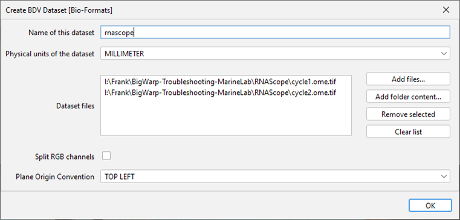
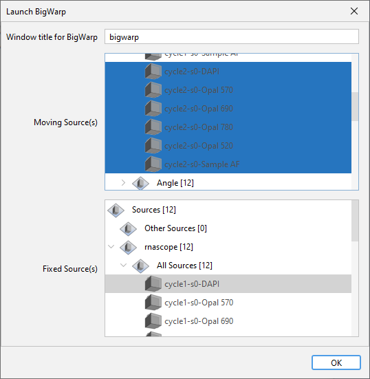
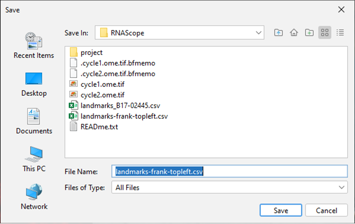
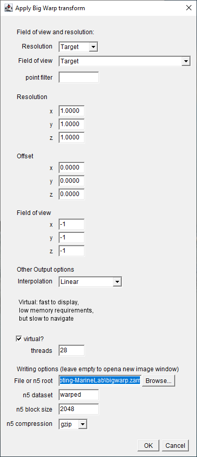
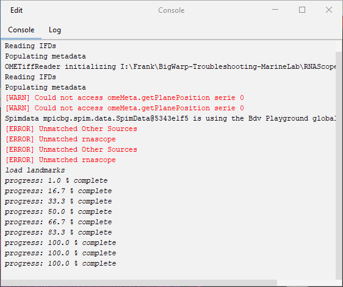

# Bigwarp Zarr to OME TIFF

This document describes how to export Zarr files from Bigwarp, and then convert them to single or multi-channel OME TIFF files.

Exporting to .zarr seems to avoid problems that Bigwarp has when exporting "large" warped images, for example images with more than ~2 billion pixels.

## Prerequisites

Create and activate a conda environment from the `environment.yml` file:

```bash
conda env create -f environment.yml
conda activate zarr-ometiff
```

We used the following versions of Fiji/ImageJ:

- ImageJ 1.54f

and for Bigwarp:

- Fiji.app/jars/bigdataviewer-playground-0.8.1.jar
- Fiji.app/jars/bigdataviewer-biop-tools-0.8.2.jar

(Enable the `PTBIOP` update site in Fiji to download Bigdataviewer and Bigwarp.)


## Creating a Bigwarp dataset

To create a dataset for use in Bigwarp, open this menu:

`Plugins > BigDataViewer-Playground > BDVDataset > Create BDV Dataset [Bio-Formats]`

A dialog like this will appear:



IMPORTANT: Make sure to set the `Plane Origin Convertion` to `TOP LEFT`!

## Launch Bigwarp

Start Bigwarp via `Plugins > BigDataViewer-Playground > Sources > Register > Launch BigWarp`.

A dialog appears that allows you to specify the images to use as fixed reference (they will not be warped), and the moving images (they will be warped onto the fixed image(s)). Typically one selects a single DAPI image as fixed reference, and all channels from the dataset that needs to be registered onto this fixed reference, as the moving images.




## Placing landmarks

Place landmarks according to the Bigwarp documentation. Save your landmarks regularly via `Bigwarp window > File > Export Landmarks`.



## Exporting the warped moving image to Zarr

Once you are happy with the warped result shown interactively in Bigwarp, it is time to save the warped images. We will save to .zarr.

`Bigwarp window > File > Export moving image` 

Fill in the export parameters as in the example dialog below:



- threads: The number of threads should be adapted to the hardware that Bigwarp is running one. Set it to a few cores less than the number of logical cores of the computer.
- File or n5 root: c:\full\path\to\warped_output.zarr
- n5 dataset: warped
- n5 block size: 2048
- n5 compression: gzip

Press OK. Warping should start, and progress feedback will be shown in the Console window in Fiji. Progress updates are only done occassionally, with relatively large jumps.



## Converting Bigwarp Zarr to OME TIFF

Once the .zarr file is saved from Bigwarp, you can quit Fiji.

Then, in the conda environment created earlier, convert the .zarr file to OME TIFF with `bigwarp-zarr-to-ometiff.ipynb'.

